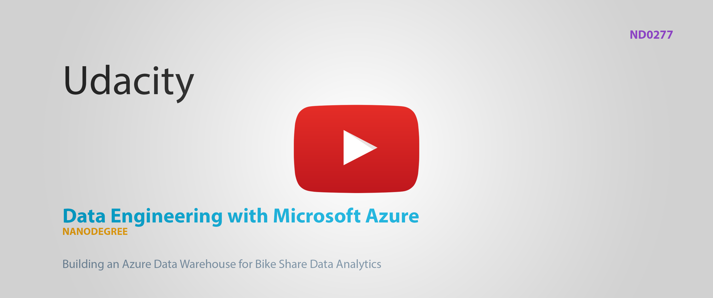
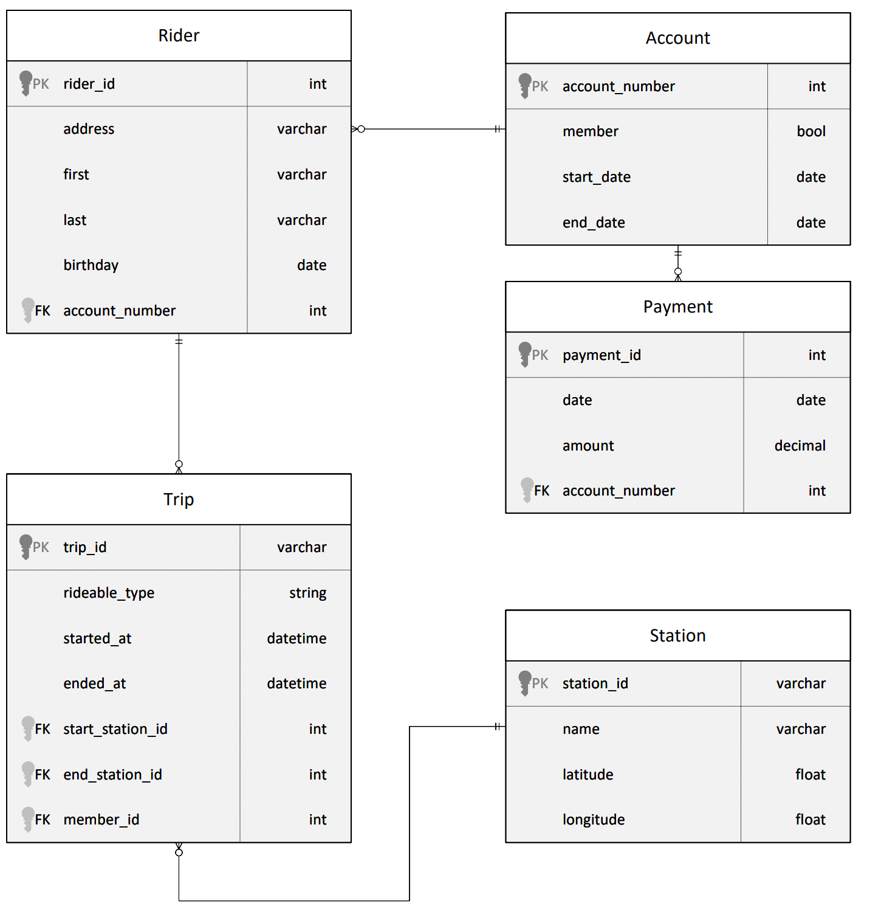
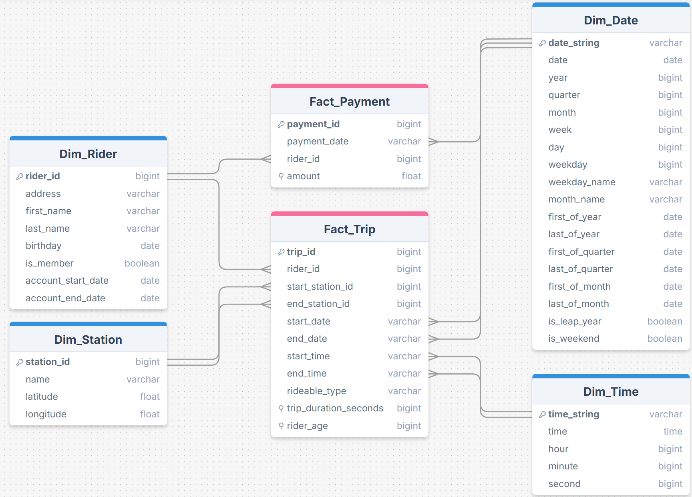

#### ND0277 - Data Engineering with Microsoft Azure

# Project 2: Building an Azure Data Warehouse for Bike Share Data Analytics


## Prerequisites

This project is set up on top of the python tooling of [Astral.sh](https://astral.sh/), escpecially their package manager `uv`. If you have it already installed you can set up this project and install all dependencies by running the following command inside the root folder.

```
uv sync
``` 

Otherwise you can find a quick install guide in this [documentation](https://docs.astral.sh/).

## Follow Along

In order to provide proof of my own work and to make following along this document easier, I recorded all steps in Azure and uploaded a cut version of it as an unlisted video to Youtube.

[](https://www.youtube.com/watch?v=lNVat3jB56M)


Below you can find markers for the different steps for easier navigation. These will also be repeated in the corresponding sections of this document. 

[0:05 Create Azure Database for PostgreSQL](https://www.youtube.com/watch?v=lNVat3jB56M&t=5s)  
[1:20 Creating Azure Synapse Analytics Workspace](https://www.youtube.com/watch?v=lNVat3jB56M&t=80s)  
[4:34 Create the data in PostgreSQL](https://www.youtube.com/watch?v=lNVat3jB56M&t=274s)  
[6:32 Create Linked Service for PostgreSQL](https://www.youtube.com/watch?v=lNVat3jB56M&t=392s)  
[8:03 Create Linked Service for Azure Blob Storage](https://www.youtube.com/watch?v=lNVat3jB56M&t=483s)  
[8:54 Extract Data from PostgreSQL](https://www.youtube.com/watch?v=lNVat3jB56M&t=534s)  
[12:22 Load Data into External Tables](https://www.youtube.com/watch?v=lNVat3jB56M&t=742s)  
[13:47 Transform Data to Star Schema](https://www.youtube.com/watch?v=lNVat3jB56M&t=827s)  
[15:01 Validate Star Schema against Staging Data](https://www.youtube.com/watch?v=lNVat3jB56M&t=901s)  


# 1 Creating a Star Schema 

As a first step I am going to transform the structure of the provided Divvy Dataset (see screenshot below) into a star schema. The entity `Account` is not provided in the dataset files for this project so it will not be covered in the DWH schema.



## Star Schema
In the following I will describe the star schema with respect to given business requirements.



**Time spent based on date/time factors:**
For this the `Fact_Trip` table can be combined with the dimensions `Dim_Date` and `Dim_Time`.

**Time spent based on start/end station:**
For this the `Fact_Trip` table can be combined with the dimension `Dim_Station`.

**Time spent based on riders age:**
This can be done by only using the `Fact_Trip` table as it holds the age of the rider at the trip time in an indexed column. Transforming this into its own dimension would be overhead as the foreign key would need an index anyways.

**Time spent based on membership status of the rider:**
For this the `Fact_Trip` table can be combined with the dimension `Dim_Rider` which holds a boolean flag for this.

**Money spent per month/quarter/year:**
For this the `Fact_Payment` table can be combined with the dimension `Dim_Date`.

**Money spent based on rider signup age:**
For this the `Fact_Payment` table can be combined with the dimension `Dim_Rider`. The age at signup is implicitly given by `birthday` and `account_start_date`.

**Money spent per member based on avg. rides/minutes per month**
Here it is possible to join the member riders from `Dim_Rider` with the `Fact_Trip` and aggregate on the `duration` or count and group by the month and filtered for a given threshold. Afterwards this can be joined with the `Fact_Payment` table and summed up by rider.

## Local Preparation

In order to test the creation of the PostgreSQL dataset and the star schema I added a [`docker-compose.yml`](/postgres/docker-compose.yaml) file in the [postgres](/postgres/) directory. This sets up a simple PostrgeSQL DB using default port `5432`.

Other parameters like initial can be configured via environment variable:

```
POSTGRES_USER=
POSTGRES_PASSWORD=
POSTGRES_DB=
```

You can start it by running 

```
cd postgres
docker compose up
```

Now you can fill this PostgreSQL DB by running the [ProjectDataToPostgres.py](./ProjectDataToPostgres.py) script. I modified the providing script to be configurable by using environment varialbes. This is to make effortles configuration changes for different environments and als prevents you from exposing your Azure credentials to git.

If you want to run the script with the provided dockerized PostgreSQL DB you need to disable `sslmode`.

Best practice is to create a `.env` file like the following example.
```
AZURE_POSTGRES_HOST="127.0.0.1"
AZURE_POSTGRES_USER="postgres"
AZURE_POSTGRES_PASSWORD="postgres"
AZURE_POSTGRES_SSL_MODE="require"
```

### Testing the Star Schema

In order to test and iterate my star schema upfront without using any cloud resources I created a bunch of `.sql` files in the [sql](./sql/) directory.
The file [ddl/create_star_schema_tables.sql](./sql/ddl/create_star_schema_tables.sql) creates the tables of the star schema, while the ones under [ingestion](./sql/ingestion/) fill the tables based on the generated DB from [ProjectDataToPostgres.py](./ProjectDataToPostgres.py).

# 2 Creating Azure Resources

First step is to set up the required resources in Azure, starting with the an *Azure Database for PostgreSQL* (see video section [0:05 Create Azure Database for PostgreSQL](https://www.youtube.com/watch?v=lNVat3jB56M&t=5s)).

Here I tweaked the settings in *Basic* as follows:
- *Workload type* set to **Development**
- For *Compute+Storage* I set 'compute tier' to **burstable** and picked **Standard_B1ms** for *compute size* as the expected workload will be marginal
- *Authentication method* restricted to **PostgresSQL authentication only** and provided *Administrator login* and *password*

In the *Network* tab I made sure that
- *Connectivity method* is set to **Public access**
- the checkbox for *Allow public access to this resource through the internet [...]* is **checked**
- the checkbox for *Allow public access from any Azure Service [...]* under *Firewall* is **checked**
- and that the current client ip address is added as a firewall rule


Next up was the creation of an *Azure Synapse Analytics* workspace ([1:20 Creating Azure Synapse Analytics Workspace](https://www.youtube.com/watch?v=lNVat3jB56M&t=80s)).

Here I made sure that the *Region* is the same as the one used for the PostgreSQL server and I provided meaningful values for the *workspace name* and *Account name* and *Filesystem name* of the *Data Lake Storage Gen2*.

In the *Security* tab I the admin credentials under *Authentication*.
    

# 3 Create the Data in Azure PostgreSQL

This step is the same as creating the PostreSQL DB for local testing as described above 
([4:34 Create the data in PostgreSQL](https://www.youtube.com/watch?v=lNVat3jB56M&t=274s)).
Simply run the script [ProjectDataToPostgres.py](ProjectDataToPostgres.py) but this time with the credentials of the actual Azure PostgreSQL database.

To verify that the tables have been created appropriately I simply connected my local db client to the Azure PostgreSQL DB.


# 4 Extract the Data from Azure PostreSQL

In order to extract the data it is necessary to define the source and the destionation. 
For this I defined two **Linked Services** in Synapse Analytics Studio. One for the PostgreSQL database ([6:32 Create Linked Service for PostgreSQL](https://www.youtube.com/watch?v=lNVat3jB56M&t=392s)) to copy the data from and one for the Azure Blob Storage ([8:03 Create Linked Service for Azure Blob Storage](https://www.youtube.com/watch?v=lNVat3jB56M&t=483s)) which is the destinatoin.

Afterwards I can use these Linked Services in the *Copy Data Tool* to build a *run once Task*
([8:54 Extract Data from PostgreSQL](https://www.youtube.com/watch?v=lNVat3jB56M&t=534s)). 

Afterwards one file for each of the four copied tables are available under *Azure Blob Storage* as well as *Azure Data Lake Storage Gen2* in the Data section of Synapse Studio.


# 5 Load the Data into External Tables

Next step is to load the extracted data, currently present as CSV files in the Azure Blob storage, into staging tables ([12:22 Load Data into External Tables](https://www.youtube.com/watch?v=lNVat3jB56M&t=742s)). 

For this I used the *Create External Table* wizzard to generate SQL scripts for each of the four files. 
In the [azure/external_tables/](/azure/external_tables/) directory I put a copy of these generated scripts.


# 6 Transform the Data into Star Schema

Finally the data from the staging tables can be transformed in the designed star schema ([13:47 Transform Data to Star Schema](https://www.youtube.com/watch?v=lNVat3jB56M&t=827s)). 
In order to do so I created six SQL scripts in the *Develop* section. These can befound under [azure/cetas/](/azure/cetas/). Each contains a `CREATE EXTERNAL TABLE ... AS SELECT` or *CETAS*. For the select part of these I could mostly reuse my ingestion scripts from the local development. There I only needed to adjust some conversions (especially date and time related) from PostgreSQL to T-SQL.

Afterwards the star schema tables can be found in the list of external tables.


As a last step I validated that the number of records in the star schema tables match the ones in the original dataset ([15:01 Validate Star Schema against Staging Data](https://www.youtube.com/watch?v=lNVat3jB56M&t=901s)).
