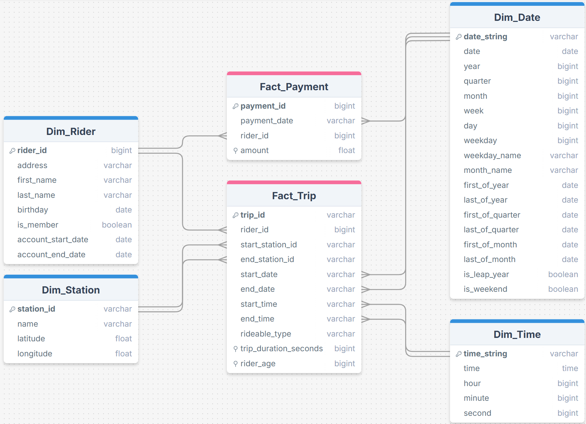

#### ND0277 - Data Engineering with Microsoft Azure

# Project 2: Cloud Data Warehouse


## Prerequisites

This project is set up on top of the python tooling of [Astral.sh](https://astral.sh/), escpecially their package manager `uv`. If you have it already installed you can set up this project and install all dependencies by running the following command inside the root folder.

```
uv sync
``` 

Otherwise you can find a quick install guide in this [documentation](https://docs.astral.sh/).

## Follow Along

In order to provide proof of my own work and to make following along this document easier, I recorded all steps in Azure and uploaded a cut version of it as an unlisted video to Youtube.

[](https://www.youtube.com/watch?v=lNVat3jB56M)


Below you can find markers for the different steps for easier navigation. These will also be repeated in the corresponding sections of this document. 

[0:05 Create Azure Database for PostgreSQL](https://www.youtube.com/watch?v=lNVat3jB56M&t=5s)  
[1:20 Creating Azure Synapse Analytics Workspace](https://www.youtube.com/watch?v=lNVat3jB56M&t=80s)  
[4:34 Create the data in PostgreSQL](https://www.youtube.com/watch?v=lNVat3jB56M&t=274s)  
[6:32 Create Linked Service for PostgreSQL](https://www.youtube.com/watch?v=lNVat3jB56M&t=392s)  
[8:03 Create Linked Service for Azure Blob Storage](https://www.youtube.com/watch?v=lNVat3jB56M&t=483s)  
[8:54 Extract Data from PostgreSQL](https://www.youtube.com/watch?v=lNVat3jB56M&t=534s)  
[12:22 Load Data into External Tables](https://www.youtube.com/watch?v=lNVat3jB56M&t=742s)  
[13:47 Transform Data to Star Schema](https://www.youtube.com/watch?v=lNVat3jB56M&t=827s)  
[15:01 Validate Star Schema against Staging Data](https://www.youtube.com/watch?v=lNVat3jB56M&t=901s)  


# 1 Creating a Star Schema 

As a first step I am going to transform the structure of the provided Divvy Dataset (see screenshot below) into a star schema. The entity `Account` is not provided in the dataset files for this project so it will not be covered in the DWH schema.


## Star Schema
In the following I will describe the star schema with respect to given business requirements.



**Time spent based on date/time factors:**
For this the `Fact_Trip` table can be combined with the dimensions `Dim_Date` and `Dim_Time`.

**Time spent based on start/end station:**
For this the `Fact_Trip` table can be combined with the dimension `Dim_Station`.

**Time spent based on riders age:**
This can be done by only using the `Fact_Trip` table as it holds the age of the rider at the trip time in an indexed column. Transforming this into its own dimension would be overhead as the foreign key would need an index anyways.

**Time spent based on membership status of the rider:**
For this the `Fact_Trip` table can be combined with the dimension `Dim_Rider` which holds a boolean flag for this.

**Money spent per month/quarter/year:**
For this the `Fact_Payment` table can be combined with the dimension `Dim_Date`.

**Money spent based on rider signup age:**
For this the `Fact_Payment` table can be combined with the dimension `Dim_Rider`. The age at signup is implicitly given by `birthday` and `account_start_date`.

**Money spent per member based on avg. rides/minutes per month**
Here it is possible to join the member riders from `Dim_Rider` with the `Fact_Trip` and aggregate on the `duration` or count and group by the month and filtered for a given threshold. Afterwards this can be joined with the `Fact_Payment` table and summed up by rider.

## Local Preparation

In order to test the 


# 2 Creating Azure Resources

[0:05 Create Azure Database for PostgreSQL](https://www.youtube.com/watch?v=lNVat3jB56M&t=5s)  
[1:20 Creating Azure Synapse Analytics Workspace](https://www.youtube.com/watch?v=lNVat3jB56M&t=80s)  


# 3 Create the Data in Azure PostgreSQL

[4:34 Create the data in PostgreSQL](https://www.youtube.com/watch?v=lNVat3jB56M&t=274s)  


# 4 Extract the Data from Azure PostreSQL

[6:32 Create Linked Service for PostgreSQL](https://www.youtube.com/watch?v=lNVat3jB56M&t=392s)  
[8:03 Create Linked Service for Azure Blob Storage](https://www.youtube.com/watch?v=lNVat3jB56M&t=483s)  
[8:54 Extract Data from PostgreSQL](https://www.youtube.com/watch?v=lNVat3jB56M&t=534s)  


# 5 Load the Data into External Tables

[12:22 Load Data into External Tables](https://www.youtube.com/watch?v=lNVat3jB56M&t=742s)    


# 6 Transform the Data into Star Schema

[13:47 Transform Data to Star Schema](https://www.youtube.com/watch?v=lNVat3jB56M&t=827s)  
[15:01 Validate Star Schema against Staging Data](https://www.youtube.com/watch?v=lNVat3jB56M&t=901s)